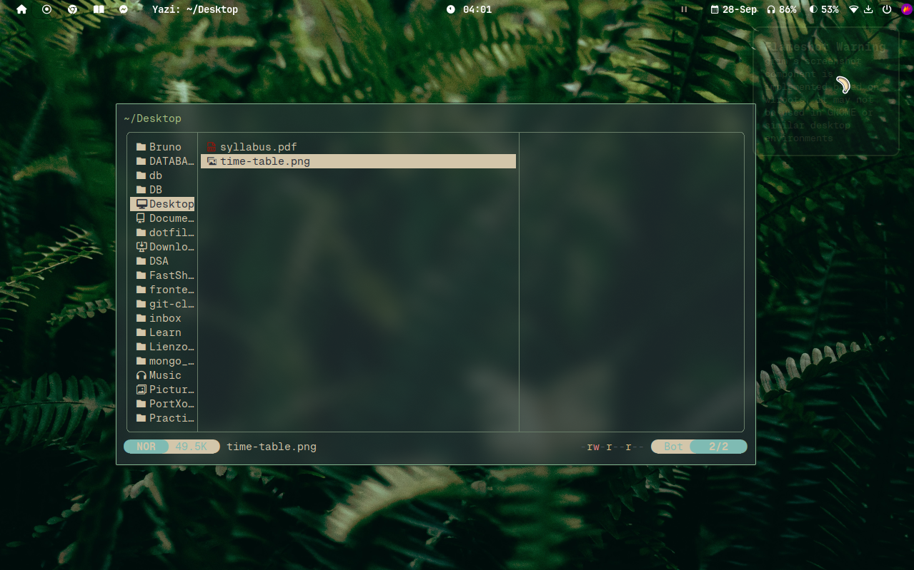

<h1 align="center">🧠 Onkar's Dotfiles</h1>
<p align="center">
  
  
  
  
</p>

---

## 🖼️ Screenshot:

> 📸 Here's a preview of my setup:

<p align="center">
  
</p>

## Features:

- Configured **i3** tiling window manager with keybindings and workspace control
- **i3blocks** with custom shell scripts (time, volume, power menu, etc.)
- **Neovim** setup with LSP, Treesitter, Lazy.nvim, statusline, and plugins
- **Alacritty** and **Kitty** with custom themes
- **Picom** compositor for blur and transparency effects
- **Dunst** notifications with a clean, readable theme
- **Rofi** for application launching
- **Polybar** (optional) for modular and customizable status bar
- Scripts and tools under `.local/bin` for system automation
- **Enhanced Shell Experience** with intelligent navigation and productivity tools

### 🚀 Shell Enhancements:

#### Zoxide Fuzzy Matching
- **Smart Directory Navigation**: Enhanced `z` command with intelligent fuzzy matching
- **Typo-Tolerant**: Handles misspelled directory names automatically
  - `z dotfidfa` → navigates to `dotfiles`
  - `z prctcl` → navigates to `Practical` 
  - `z fastshp` → navigates to `FastShop`
- **Silent Operation**: Clean navigation without verbose output
- **Intelligent Scoring**: Multi-criteria algorithm for best match selection
- **Fallback Support**: Interactive selection with `zinter` command when needed

#### Custom Functions & Aliases
- **Auto-commit**: `gencommit` - AI-powered conventional commit message generation
- **File Operations**: `extract`, `cleanup`, `trash` for common file tasks
- **Development Tools**: `jrun` for Java compilation and execution
- **System Utilities**: `life`, `goal`, `timer` for productivity tracking
- **Enhanced Navigation**: `j` alias for quick directory jumping

---

## 🎯 Quick Usage:

### Navigation Commands:
```bash
# Smart directory navigation with typo tolerance
z config          # Exact match: goes to ~/.config
z dotfidfa        # Fuzzy match: goes to dotfiles
z prctcl          # Fuzzy match: goes to Practical
j projects        # Same as 'z' (alias)
zinter           # Interactive selection with fzf
```

### Development Workflow:
```bash
# Auto-generate commit messages
git add .
gencommit         # AI-powered conventional commits

# Java development
jrun HelloWorld   # Compile and run HelloWorld.java

# File operations
extract file.zip  # Smart extraction for multiple formats
cleanup          # Remove node_modules, venv, .DS_Store
```

---

## Folder Structure:

```bash
.
├── .bashrc
├── .gitconfig
├── .tmux.conf
├── .zshrc
├── .zsh_functions
├── .local/bin/
├── .config/
│   ├── alacritty/
│   ├── kitty/
│   ├── dunst/
│   ├── i3/
│   ├── i3blocks/
│   ├── nvim/
│   ├── picom/
│   ├── polybar/
│   └── rofi/
```

## Installation:
Make sure stow is installed on your system.

```bash
git clone https://github.com/onkarsathe007/dotfiles.git ~/dotfiles
cd ~/dotfiles
stow .
```
This will symlink all relevant configuration files to your $HOME directory.

### Dependencies:
For the complete experience, install these packages:
```bash
# Core dependencies
zoxide              # Smart directory navigation
fzf                 # Fuzzy finder
eza                 # Modern ls replacement
neovim              # Text editor
tmux                # Terminal multiplexer

# Window manager & desktop
i3                  # Tiling window manager
i3blocks            # Status bar
alacritty           # Terminal emulator
rofi                # Application launcher
picom               # Compositor
dunst               # Notification daemon

# Development tools
git                 # Version control
tgpt                # AI assistant for commit messages (optional)
```

### Post-installation:
1. **Reload your shell**: `source ~/.zshrc` or restart terminal
2. **Install Neovim plugins**: Open nvim and run `:Lazy sync`
3. **Build zoxide database**: Navigate to frequently used directories with `z`

## Credits:

Inspired by: ThePrimeagen, ChrisTitusTech, ArchWiki
Themes: Catppuccin, Aura Theme


>“Keep it simple. Make it yours.” — Onkar

